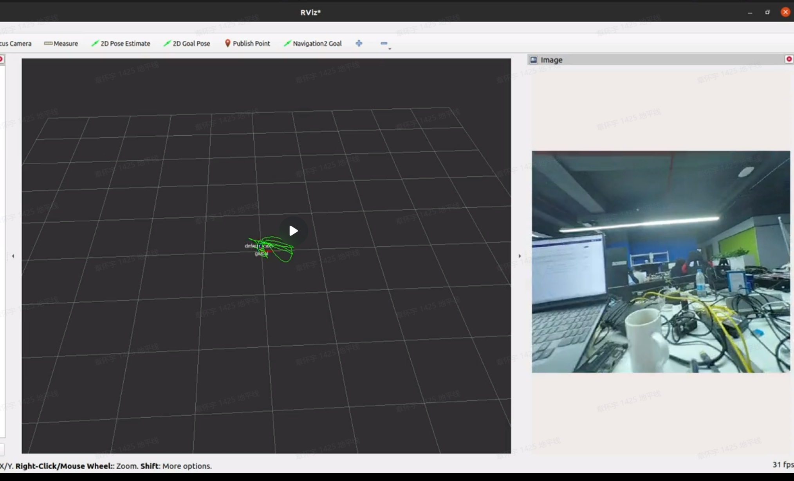
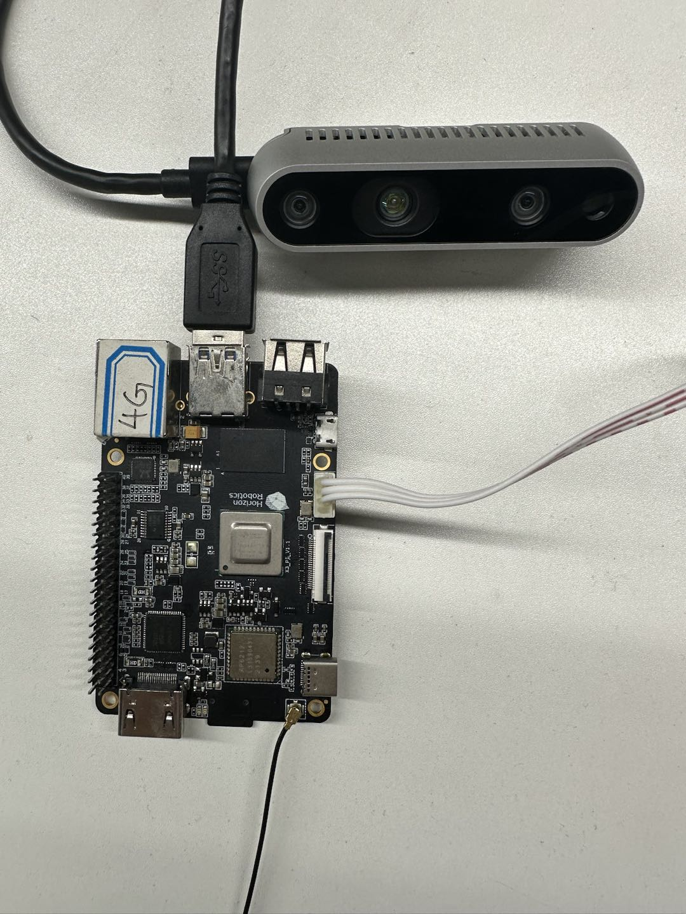
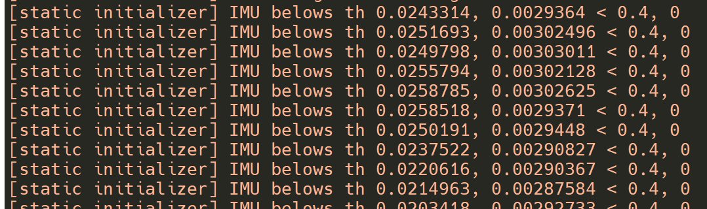
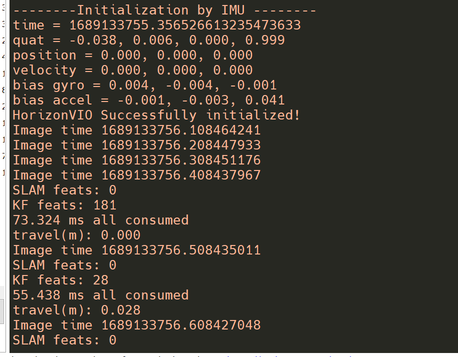
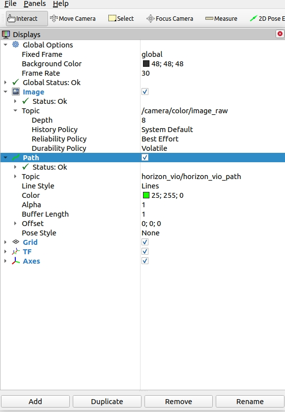
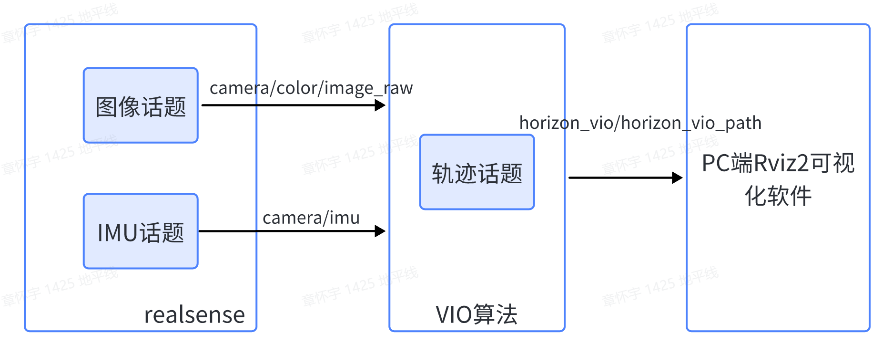

# 功能介绍

视觉惯性里程计（Visual Inertial Odometry，VIO）是融合相机与惯性测量单元（Inertial Measurement Unit，IMU）数据实现机器人定位的算法。VIO定位算法具有成本低、适用环境广等优点，在室外环境下能够有效弥补卫星定位中遮挡、多路径干扰等失效场景。优秀、鲁棒的VIO算法是实现室外高精度导航定位的关键。


代码仓库：<https://github.com/HorizonRDK/hobot_vio.git>

# 物料清单

| 机器人名称          | 生产厂家 | 参考链接                                                     |
| :------------------ | -------- | ------------------------------------------------------------ |
| RDK X3             | 具体见参考链接 | [点击跳转](https://developer.horizon.cc/sunrise) |
| realsense          | Intel RealSense D435i |             |

# 使用方法

## 准备工作

在体验之前，需要具备以下基本条件：

- 地平线RDK已烧录好地平线提供的Ubuntu 20.04系统镜像
- 地平线RDK已安装
- realsense连接到RDK X3 USB 3.0接口

算法订阅realsense相机的图像和IMU数据作为算法的输入，经过计算得到相机的轨迹信息，
并通过ROS2的话题机制发布相机的运动轨迹，轨迹结果可在PC的rviz2软件查看。


## 硬件连接
Realsense与RDK X3连接方式如下图：
 
 
**1.安装功能包**

启动机器人后，通过终端或者VNC连接机器人，复制如下命令在RDK的系统上运行，完成相关Node的安装。

```bash
sudo apt update
sudo apt install -y tros-hobot-vio
```
 
**2.运行VIO功能**

启动命令，launch文件内包含启动realsense相机和vio算法模块的命令，所以只用运行一个launch文件即可：

```shell
# 配置tros.b环境
source /opt/ros/foxy/setup.bash
source /opt/tros/local_setup.bash

ros2 launch hobot_vio hobot_vio.launch.py 
```

程序运行后，会进入等待初始化状态，此时必须相机必须保持静止。
 
此时相机向前平移一段距离，此时算法检测到相机平移则会完成初始化，
此时相机持续运动，开始视觉与惯性的融合定位过程。
 

**3.查看效果**
这里采用rivz2的方式观察VIO算法的效果，需要在PC上安装ROS2。并且保证PC与RDK X3处于同一网段。
rviz2的话题订阅如下图所示，详细的话题解释在“接口说明”一节：
 

 展示效果如下动图所示


# 接口说明

 


## 输入topic
| 参数名 | 类型 | 解释  | 是否必须 | 默认值 |
| ----- | ----| -----| ------- | -----|
| path_config  | std::string | vio算法配置文件路径 | 是        | /opt/tros/lib/hobot_vio/config/realsenseD435i.yaml |
| image_topic  | std::string | vio算法订阅的图像数据话题名  | 是 | /camera/infra1/image_rect_raw |
| imu_topic    | std::string | vio算法订阅的IMU数据话题名  | 是 | /camera/imu  |
| sample_gap  | std::string | vio算法处理频率，1表示每帧图像都会参与轨迹计算，2表示每两帧图像计算一次，依此类推 | 是  | 2 |

## 输出topic

| topic名 | 类型 | 解释  |
| ----- | ----| -----| 
| horizon_vio/horizon_vio_path  | nav_msgs::msg::Path | vio算法输出的机器人运动轨迹  |


# 常见问题
1、Ubuntu下运行启动命令报错-bash: ros2: command not found
当前终端未设置ROS2环境，执行命令配置环境：
```
source /opt/tros/local_setup.bash
```
2、如何在RDK上安装realsense的ROS2 package
```
# 以ROS2 Foxy版本为例
sudo apt-key adv --keyserver keyserver.ubuntu.com --recv-key F6E65AC044F831AC80A06380C8B3A55A6F3EFCDE 
sudo apt-key adv --keyserver hkp://keyserver.ubuntu.com:80 --recv-key F6E65AC044F831AC80A06380C8B3A55A6F3EFCDE
sudo curl -sSL https://raw.githubusercontent.com/ros/rosdistro/master/ros.key -o /usr/share/keyrings/ros-archive-keyring.gpg
echo "deb [arch=$(dpkg --print-architecture) signed-by=/usr/share/keyrings/ros-archive-keyring.gpg] http://packages.ros.org/ros2/ubuntu $(source /etc/os-release && echo $UBUNTU_CODENAME) main" | sudo tee /etc/apt/sources.list.d/ros2.list > /dev/null
sudo apt-get install software-properties-common
sudo add-apt-repository "deb https://librealsense.intel.com/Debian/apt-repo $(lsb_release -cs) main" -u
sudo apt-get update
sudo apt=-get install ros-foxy-librealsense2* ros-foxy-realsense2-camera ros-foxy-realsense2-description -y
```
3、如何保存VIO算法的轨迹
程序启动之后会自动实时保存轨迹到文件，文件名为 trans_quat_camera_xx.txt。文件内容如下：
```
1688615183.065757036 -0.081376 -0.040180 0.030833 -0.501420 -0.461689 0.520512 0.514285
......
```
数据列分别为时间戳、x、y、z坐标、四元数w、x、y、z。

4、VIO注意事项：

a. 单目VIO运行前需要进行初始化，具体见“2.运行VIO功能”这一节。

b. 移动相机过程中尽量平缓。
